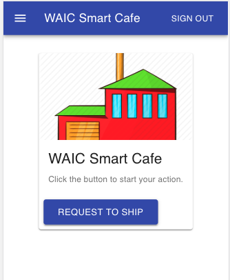
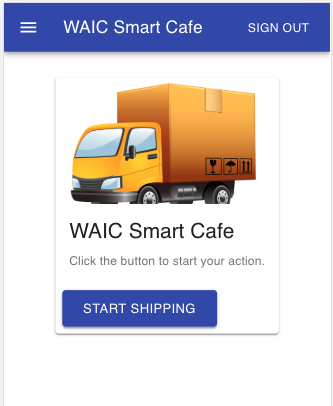
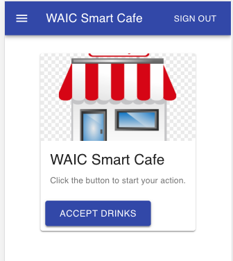

# WAIC Smart Cafe Ctrl

This is the controller for Smart Cafe WAIC demo. Every stakeholder or host use the same
app. The app is written in Web technology, it is expected to run on every device.

If case of anonymous, you will need to login to use the APP. The registration
will be closed during the WAIC.

## Sidebar
Click the menu button to open the sidebar. Different stakeholders click on the sidebar button
to choose their role.

The **Reset** button is used to reset the entire demo. Normally, it should be used 
at the beginning of every run by the host.

The **Create an order** button is used to manually place an order, in case **DeepLens** stops 
working.

## Host
The host will click **INTRO**, **DEMO**, **SUMMARY** button to enter different stage.

## Manufacturer
Manufacturer will click the button to fire a shipping request.

## Shipping Company
Shipping Company press the button to start shipping.

## Retailer
After the retailer receives the bottles, s/he will press the button.

