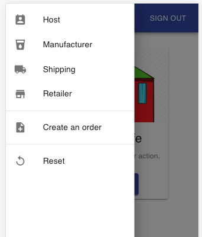

# Amplify and Material UI demo

AWS Amplify is the fastest and easiest way to build mobile applications on AWS. 
Amplify allows you quickly set up authentication, analytics, and offline data sync for 
your mobile applications with a few commands and integrate them into your application with 
a few lines of code.

[Material UI](https://material-ui.com/) provides a large set of React components for faster and 
easier web development.

This demo shows how to quickly build an application using AWS Amplify Framework and Material UI
library with authentication, API features and a modern user interface. Additionally, we will use 
AWS Amplify Console to deploy this cloud native application.

## Prerequisite

1. Install [AWS Amplify CLI](https://github.com/aws-amplify/amplify-cli#install-the-cli)

1. Configure AWS credentials on your local development environment

1. Nodejs 8+ 

## Getting started

1. install the dependencies, type `npm install` in terminal

1. Create the backend using Amplify CLI. The amplify configuration file has been created in `./amplify` foloder
it contains a Cognito User Pool which used for authentication.
    ```shell script
    amplify init
    amplify push
    ```
1. create file `src/api-config.js`
    ```javascript
    const config = {
      "orderAPIUrl": "http://<order-api-url>",
      "stageAPIUrl": "https://<stage-api-url>"
    };
    
    export default config;
    ```
1. Run command `npm start` to run the web application locally. 

1. To build the artifact, run `npm run build`, the artifact will be genreated in `./build` folder

1. Check the source code to see how to use AWS Amplify with Material UI library.


## Screenshots

Click the menu button to open the sidebar. 



Screen 2


